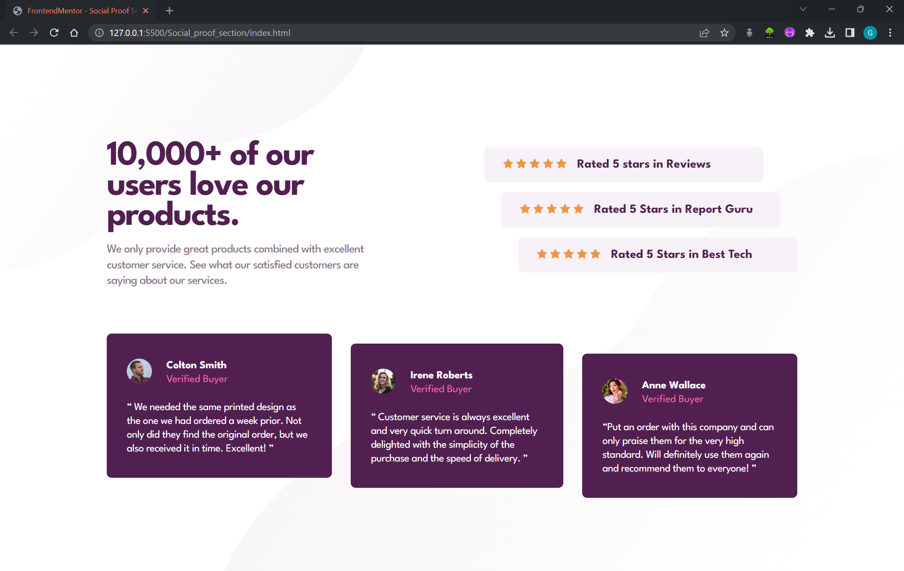
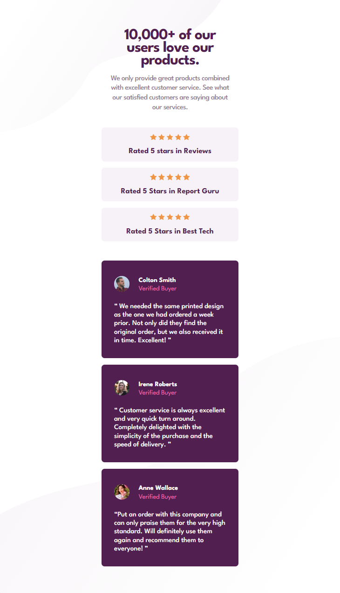

# Frontend Mentor - Solution for "Social Proof Section"

This is a solution to the [Social proof section challenge on Frontend Mentor](https://www.frontendmentor.io/challenges/social-proof-section-6e0qTv_bA). Frontend Mentor challenges help you improve your coding skills by building realistic projects.

## Table of contents

- [What I Did](#what-i-did)
- [What Will Be Next](#what-will-be-next)
- [Screenshots](#screenshots)
- [Design](#design)

## What I Did

1. Coded the HTML page, than added the content inside it.
2. Created the CSS file and linked it to the HTML document.
3. Coded the CSS following the "Mobile-First" rule, using media query.
4. Coded the CSS for desktop displays.

\*Mention: I used Figma.

## What Will Be Next

1. I will study more about CSS and I'll make my containers grow and shrink.
2. I will simplify the HTML document, because I noticed I nested block-level elements inside divs and. Also, I believe can use "display: block" to simplify the HTML.
3. I will study about SASS and convert my Vanilla CSS into SASS.

## Screenshots

1. DESKTOP VERSION
   

2. MOBILE VERSION  
   

## Design

Here you can see how the website should look.

