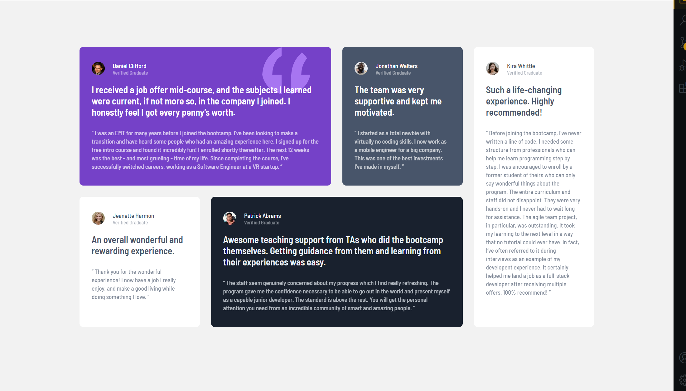

# Frontend Mentor - Solution for "Testimonials Grid Section"

This is a solution to the [Social proof section challenge on Frontend Mentor](https://www.frontendmentor.io/challenges/testimonials-grid-section-Nnw6J7Un7). Frontend Mentor challenges help you improve your coding skills by building realistic projects.

## Table of contents

- [What I Did](#what-i-did)
- [Screenshots](#screenshots)
- [Design](#design)

## What I Did

1. I took the colors and created CSS variables.
2. Coded the HTML page, than added the content inside it.
3. Created the CSS file and linked it to the HTML document.
4. Coded the CSS following the "desktop-first" rule, using media query.
5. Coded the CSS for mobile displays.

\*Mention: I used Figma.

## Screenshots

1. DESKTOP VERSION
   

2. MOBILE VERSION  
   

## Design

Here you can see how the website should look.

